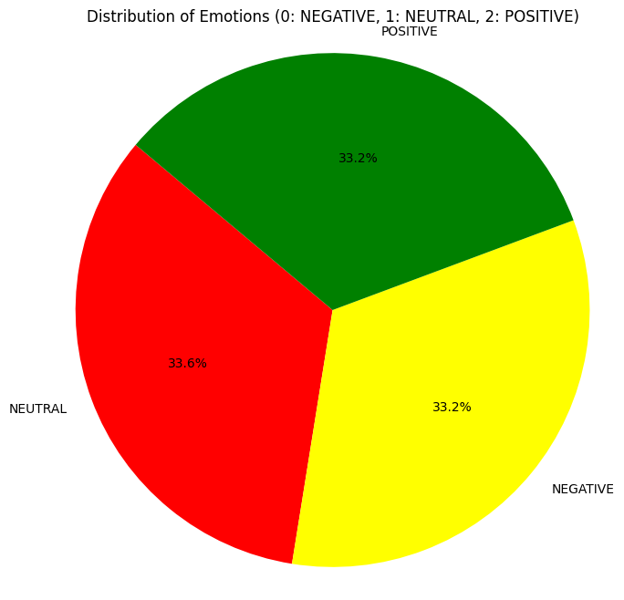
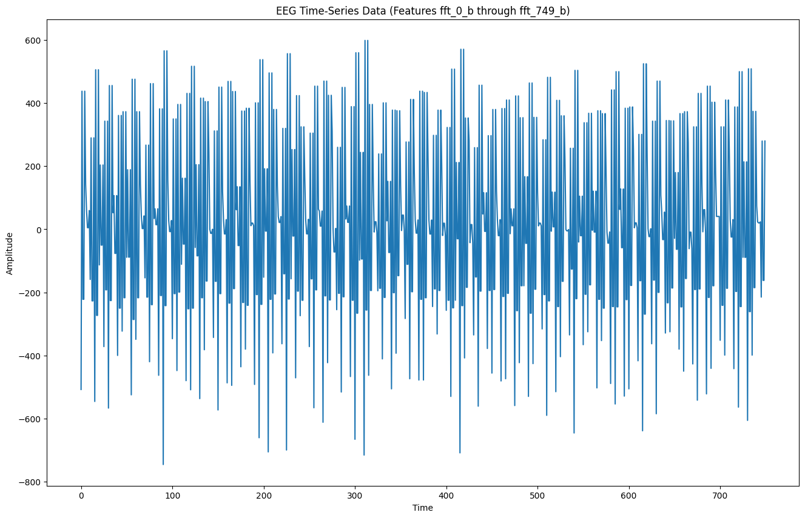
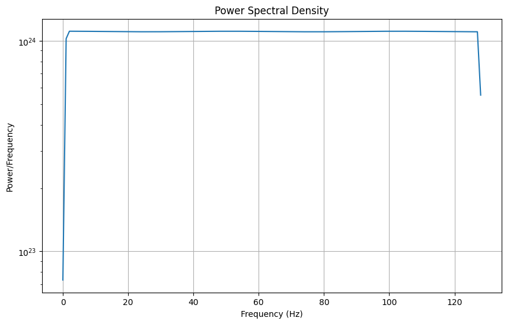
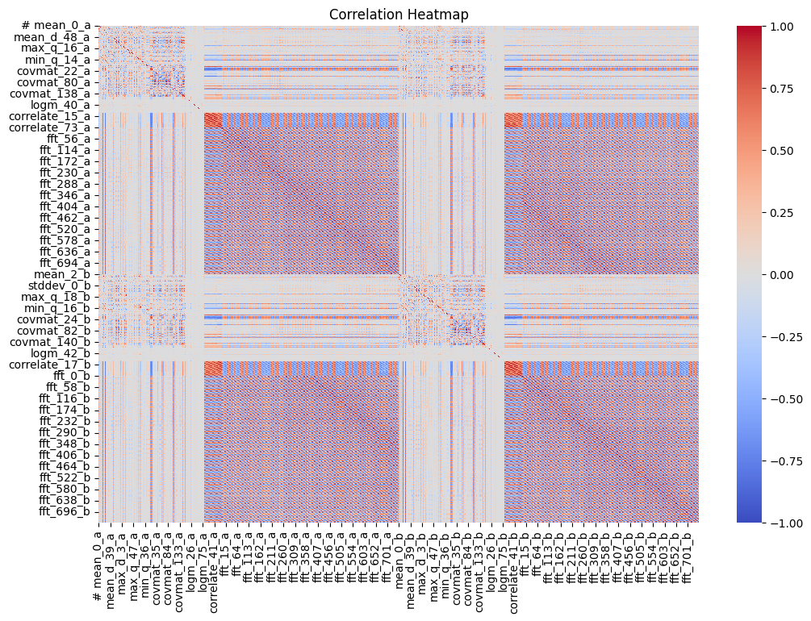
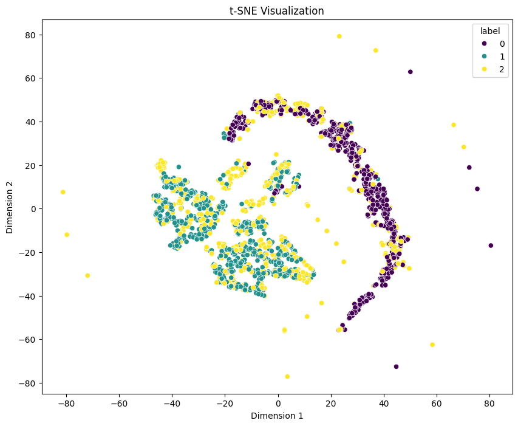
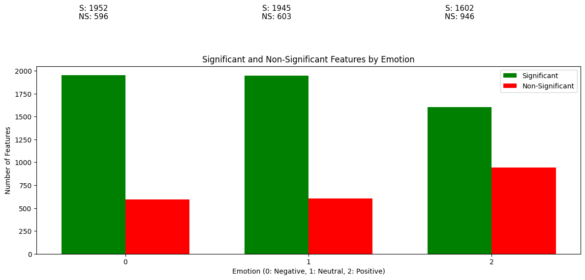
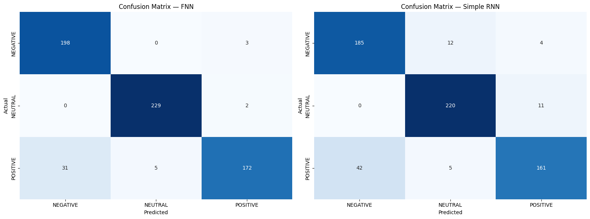
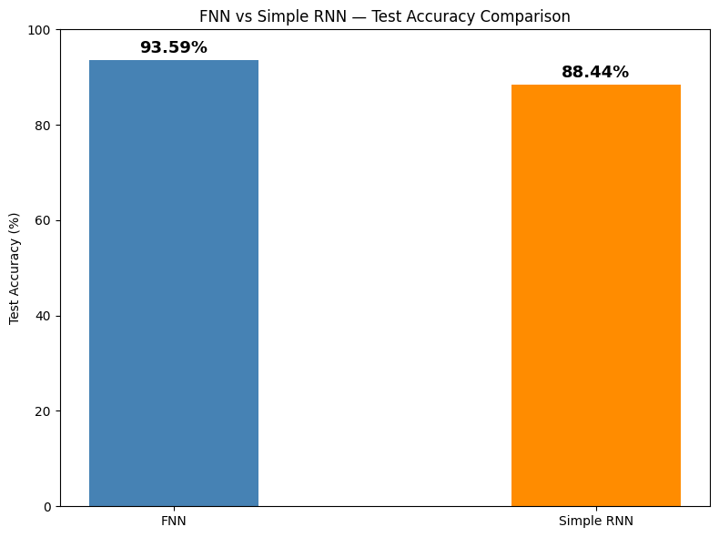

## EEG Emotion Recognition using Deep Learning

### Overview
This project investigates emotion recognition from EEG (Electroencephalography) brainwave signals using deep learning. The objective is to classify EEG recordings into three emotional states: Negative, Neutral, Positive.

It includes exploratory data analysis (EDA), signal analysis, statistical feature evaluation, and a comparison of two neural network architectures:

- Feedforward Neural Network (FNN)
- Simple Recurrent Neural Network (RNN)

### Dataset

The dataset used is the EEG Brainwave Dataset for Feeling Emotions from Kaggle. It contains 2,132 EEG recordings represented by 2,548 engineered features extracted from brainwave signals and labeled with one of three emotional states.
(https://www.kaggle.com/datasets/birdy654/eeg-brainwave-dataset-feeling-emotions)


### Models Evaluated

| Model | Test Accuracy |
|---------|----------|
| Feedforward Neural Network (FNN) | 93.59% |
| Simple Recurrent Neural Network (RNN) | 88.44% |

### Key Result

The Feedforward Neural Network significantly outperformed the Simple RNN, achieving **93.59% test accuracy** compared to **88.44%**.

This suggests that the EEG features behave more like high-dimensional spectral/tabular data than a true sequential time series, making dense neural architectures more suitable than recurrent ones.

---

# Dataset Description

The EEG Brainwave Dataset for Feeling Emotions contains EEG recordings collected from subjects experiencing different emotional states.

Each sample consists of:

- 2,548 numerical features
- One emotion label

The emotion labels were encoded as:

| Emotion | Label |
|----------|---------|
| Negative | 0 |
| Neutral | 1 |
| Positive | 2 |

### Class Distribution


The balanced class distribution reduces the likelihood of bias toward a specific emotion class during training.

---

The project followed the following pipeline:

```text
Raw EEG Features
        ↓
Exploratory Data Analysis
        ↓
Statistical Feature Analysis
        ↓
Feature Standardization
        ↓
Train/Test Split
        ↓
FNN Training
        ↓
RNN Training
        ↓
Evaluation & Comparison
```

--- 

# Exploratory Data Analysis (EDA)

## 1. Emotion Distribution Analysis

A pie chart was generated to visualize the distribution of emotion classes.

### Purpose

- Verify class balance
- Detect potential dataset bias
- Understand dataset composition



### Observation

The dataset is nearly perfectly balanced across all three emotion categories, making it suitable for supervised classification.

---

## 2. EEG Signal Visualization

A sample EEG signal was visualized using FFT-derived features.

### Purpose

- Understand signal structure
- Observe variation in amplitudes
- Gain intuition about EEG feature representation



### Observation

The EEG signal exhibits large fluctuations across frequency components, reflecting the complex nature of neural activity.

---

## 3. Power Spectral Density Analysis

Power Spectral Density (PSD) was computed using Welch's method.

### Purpose

- Analyze frequency-domain characteristics
- Measure power distribution across frequencies
- Identify dominant spectral regions



### Observation

The PSD plot reveals non-uniform power distribution across frequencies, indicating that certain frequency regions contribute more strongly to the signal representation.

---

## 4. Correlation Analysis

A correlation heatmap was generated using all numerical features.

### Purpose

- Identify relationships between features
- Detect redundancy
- Explore feature interactions



### Observation

Several feature groups display strong correlations, suggesting that portions of the EEG representation capture related signal characteristics.

---

## 5. t-SNE Visualization

t-SNE dimensionality reduction was applied to project the high-dimensional feature space into two dimensions.

### Purpose

- Visualize class separability
- Explore feature-space structure
- Assess classification difficulty



### Observation

The three emotion classes form partially separated clusters. While overlap exists, noticeable grouping indicates that the EEG features contain discriminative information useful for emotion classification.

---

## 6. Statistical Significance Analysis

Independent-sample t-tests were performed for every feature and emotion category.

### Purpose

- Determine feature relevance
- Quantify discriminative power
- Identify statistically meaningful EEG characteristics



### Observation

A large proportion of features were statistically significant (*p* < 0.05), suggesting that emotional states influence EEG-derived measurements in measurable ways.

---

# Data Preprocessing

## Label Encoding

Emotion labels were converted into numerical values:

- Negative → 0
- Neutral → 1
- Positive → 2

## Feature Scaling

Standardization was performed using `StandardScaler`.

This transformed all features to:

- Mean = 0
- Standard Deviation = 1

Standardization improves neural network training stability and prevents features with larger magnitudes from dominating optimization.

## Train-Test Split

The dataset was divided into:

- Training Set: 70%
- Test Set: 30%

Resulting shapes:

- Training: (1492, 2548)
- Testing: (640, 2548)

---

# Model 1: Feedforward Neural Network (FNN)

## Architecture

```text
Input Layer (2548 Features)
        ↓
Dense (256, ReLU)
        ↓
Dropout (0.5)
        ↓
Dense (128, ReLU)
        ↓
Dropout (0.5)
        ↓
Dense (3, Softmax)
```

### Training Configuration

- Optimizer: Adam
- Loss Function: Sparse Categorical Crossentropy
- Batch Size: 32
- Maximum Epochs: 70
- Early Stopping Enabled
- Validation Split: 20%

### Parameters

**Total Trainable Parameters:** 685,827

### Performance

**Test Accuracy:** 93.59%

| Class | Precision | Recall | F1 Score |
|---------|----------|----------|----------|
| Negative | 0.86 | 0.99 | 0.92 |
| Neutral | 0.98 | 0.99 | 0.98 |
| Positive | 0.97 | 0.83 | 0.89 |

---

# Model 2: Simple Recurrent Neural Network (RNN)

## Architecture

```text
Input Layer (2548 Features)
        ↓
Reshape (2548, 1)
        ↓
SimpleRNN (256 Units)
        ↓
Flatten
        ↓
Dense (3, Softmax)
```

### Training Configuration

- Optimizer: Adam
- Loss Function: Sparse Categorical Crossentropy
- Batch Size: 32
- Epochs: 50
- Validation Split: 20%

### Parameters

**Total Trainable Parameters:** 2,022,915

### Performance

**Test Accuracy:** 88.44%

| Class | Precision | Recall | F1 Score |
|---------|----------|----------|----------|
| Negative | 0.81 | 0.92 | 0.86 |
| Neutral | 0.93 | 0.95 | 0.94 |
| Positive | 0.91 | 0.77 | 0.84 |

---

# Model Comparison

| Metric | FNN | RNN |
|----------|----------|----------|
| Accuracy | 93.59% | 88.44% |
| Parameters | 685,827 | 2,022,915 |
| Training Stability | High | Moderate |
| Best Model | ✅ | |

The FNN achieved higher accuracy despite having significantly fewer parameters.




---

# Discussion

The superior performance of the Feedforward Neural Network can be explained by the nature of the input features.

Although the FFT coefficients are ordered numerically, they do not represent a true temporal sequence. Instead, they form a fixed-length spectral representation of the EEG signal. Consequently, the sequential inductive bias of the RNN provides limited benefit.

The FNN treats the FFT coefficients as a high-dimensional feature vector and learns global nonlinear relationships through dense connections. This aligns more closely with the structure of the data and allows the model to generalize more effectively.

This result highlights an important machine learning principle: **model architecture should be selected based on the structure of the data rather than simply applying more complex architectures.**

---

# Technologies Used

- Python
- NumPy
- Pandas
- Matplotlib
- Seaborn
- SciPy
- Scikit-Learn
- TensorFlow / Keras

---